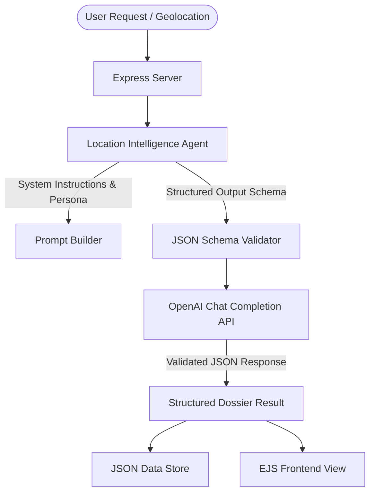
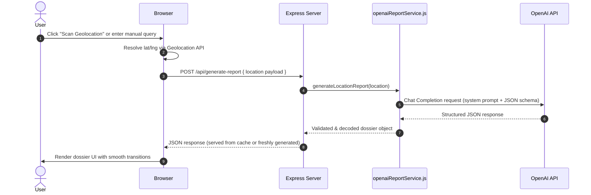

# PlaceHack AI — Agentic Architecture & Specifications

**Document Version:** 1.0.0
**Classification:** Internal Technical Reference
**Scope:** Runtime Intelligence Agents · Design-Time Development Agents
**Related:** [skills.md](skills.md)

---

## Overview

PlaceHack AI is built on a dual-agent architecture that separates concerns cleanly between *intelligence* and *engineering*. At runtime, a **Location Intelligence Agent** handles geospatial reasoning, cultural synthesis, and structured JSON dossier generation. At design time, a **Codex Development Agent** manages UI implementation, build automation, and iterative verification. Together, they define the full execution surface of the PlaceHack AI system.

---

## 1. Runtime Agent: Location Intelligence Dossier Agent

The Location Intelligence Agent is the core AI brain of PlaceHack AI. Powered by an OpenAI model (e.g., `gpt-5-mini`), it receives a geolocation input, reasons over it, and produces a fully structured location dossier conforming to a strict JSON schema. It operates statelessly per request — each invocation is self-contained and independently validated.

### System Architecture



### Agent Persona & System Instructions

| Attribute | Value |
|---|---|
| **Agent Name** | `PlaceHack Intelligence Agent` |
| **Archetype** | World-class travel writer, cultural anthropologist, and historical guide |
| **Tone** | Poetic, specific, vivid, and highly structured |
| **Formatting Constraint** | Strictly emoji-free output at all times |

**Core Behavioral Directives**

- Prioritize lesser-known local stories, hidden histories, and non-obvious cultural insights over generic tourist highlights.
- Produce precise, actionable practical tips — no vague advice.
- Maintain absolute compliance with the defined JSON response schema on every invocation. Schema violations are treated as hard failures.
- Never fabricate historical dates, names, or facts. If reliable data is unavailable for a field, use a clearly hedged phrasing (e.g., "circa," "reportedly") rather than inventing specifics.

---

## 2. Design-Time Agent: Codex Development Agent

Codex is the agentic pair programmer responsible for co-engineering the PlaceHack AI application. It operated across the full development lifecycle — from planning and implementation to build verification — using a structured, context-aware workflow.

### Agentic Collaborative Development Workflow

**Phase 1 — Interactive Planning**

Before writing any code, Codex engaged in a structured planning phase:

- Clarified and locked down UI requirements, including component hierarchy and layout contracts.
- Verified the design token system (e.g., confirming `primary-600` values across dark and light mode).
- Identified and resolved known constraints upfront, including PDFKit layout limitations and Tailwind purge configuration edge cases.

**Phase 2 — Context-Aware Implementation**

During implementation, Codex operated with full codebase awareness:

- Analyzed the existing workspace structure before making any changes to avoid regressions.
- Applied targeted, minimal edits using precise tool calls rather than wholesale rewrites.
- Compiled and validated frontend assets via Vite after each significant change to catch errors early.

**Phase 3 — Automated Verification**

Every implementation cycle concluded with an automated verification pass:

- Executed Node.js runtime checks to confirm the Express server starts and responds correctly.
- Ran production Vite builds to verify bundle integrity, CSS purge results, and asset output.
- Reviewed build output logs for warnings and addressed them before handoff.

---

## 3. Agent Workflow Orchestration

The following sequence diagram describes the complete report generation workflow — from user interaction to rendered dossier. Each step represents a discrete, observable handoff between system components.



**Step Notes**

- **Step 2** — The browser first attempts GPS-grade coordinates. On failure, it falls back to IP-based geolocation. The resolution method is logged and passed alongside the coordinates so the agent can adjust confidence language in its output if needed.
- **Step 4** — `generateLocationReport` is responsible for prompt assembly, schema injection, and initial response validation. It is the sole integration point with the OpenAI API.
- **Step 7** — The service layer validates the response against the full JSON schema before passing it upstream. A failed validation triggers a one-pass repair prompt before surfacing an error.
- **Step 8** — Responses are cached by location key (normalized coordinates or place name) to prevent redundant API calls for repeated queries within a session.

---

## 4. Agent Configuration & Environment

All runtime agent parameters are externalized to environment variables, allowing model and performance tuning without code changes.

| Parameter | Environment Variable | Default | Description |
|---|---|---|---|
| **Model** | `OPENAI_MODEL` | `gpt-5-mini` | The OpenAI model executing the agent's analysis and synthesis. |
| **Schema Enforcement** | `response_format` | `json_schema` | Activates OpenAI's structured outputs mode, enforcing schema compliance at the API level. |
| **Token Budget** | `OPENAI_MAX_COMPLETION_TOKENS` | `9000` | Maximum completion tokens allocated per request. Reasoning models require generous headroom to avoid truncated JSON. |
| **Reasoning Effort** | `OPENAI_REASONING_EFFORT` | `low` | Controls internal chain-of-thought token usage. Set to `low` to preserve token budget for the output payload rather than internal reasoning traces. |

**Configuration Notes**

- `OPENAI_REASONING_EFFORT` should only be raised to `medium` or `high` if output quality for complex or ambiguous locations proves insufficient. Raising it reduces the effective token budget available for the JSON response.
- When switching to a different model family (e.g., a non-reasoning model), `OPENAI_REASONING_EFFORT` has no effect and should be omitted from the request payload to avoid API warnings.
- All environment variables must be present in `.env` at startup. Missing keys cause the service to throw a fatal configuration error rather than failing silently at request time.

---

## 5. Agent Interaction & System Boundaries

```
┌─────────────────────────────────────────────────────────┐
│                    PlaceHack AI System                  │
│                                                         │
│  ┌─────────────────────────┐                            │
│  │   Codex (Design-Time)   │                            │
│  │                         │                            │
│  │  UI / Tailwind CSS      │  ← Operates during         │
│  │  PDF Export (PDFKit)    │    development only        │
│  │  Vite Build & Verify    │                            │
│  └─────────────────────────┘                            │
│                                                         │
│  ┌─────────────────────────────────────────────────┐    │
│  │           Runtime Request Lifecycle             │    │
│  │                                                 │    │
│  │  Browser → Express Server → openaiReportService │    │
│  │                                  │              │    │
│  │                    ┌─────────────▼────────────┐ │    │
│  │                    │  Location Intelligence   │ │    │
│  │                    │        Agent             │ │    │
│  │                    │                          │ │    │
│  │                    │  · Prompt Assembly       │ │    │
│  │                    │  · Schema Injection      │ │    │
│  │                    │  · OpenAI API Call       │ │    │
│  │                    │  · Response Validation   │ │    │
│  │                    └──────────────────────────┘ │    │
│  └─────────────────────────────────────────────────┘    │
└─────────────────────────────────────────────────────────┘
```

---

## 6. Related Documentation

| Document | Description |
|---|---|
| [skills.md](skills.md) | Detailed capability specs for both agents — geolocation, dossier schema, UI conventions, PDF export, and build toolchain. |

---

*Last updated: June 2026 · Maintained by the PlaceHack AI core team*