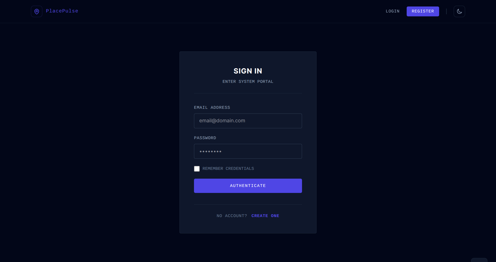
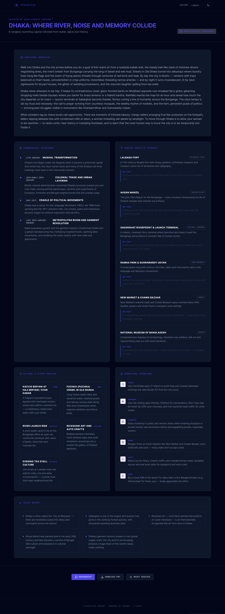

# PlaceHack AI

**One-click instant deep-dive location reports created by Misbah.**

PlaceHack AI turns any place into a structured cultural intelligence dossier. Scan your coordinates or search manually — the Location Intelligence Agent synthesizes history, must-visit spots, local flavors, practical tips, and fun facts into a polished, scrollable report you can save and export as PDF.

Built with a Node.js backend, Tailwind CSS frontend, agentic development notes ([AGENTS.md](AGENTS.md), [skills.md](skills.md)), and meaningful OpenAI platform integration.

## Table of Contents

- [PlaceHack AI](#PlaceHack-ai)
  - [Table of Contents](#table-of-contents)
  - [Features](#features)
  - [Tech Stack](#tech-stack)
  - [Requirements](#requirements)
  - [Running Locally](#running-locally)
    - [1. Clone the repository](#1-clone-the-repository)
    - [2. Install dependencies](#2-install-dependencies)
    - [3. Configure environment](#3-configure-environment)
    - [4. Start the application](#4-start-the-application)
    - [5. Open in browser](#5-open-in-browser)
  - [How to Use](#how-to-use)
  - [Screenshots](#screenshots)
  - [Problem \& Impact](#problem--impact)
    - [What problem does the project solve?](#what-problem-does-the-project-solve)
    - [Who benefits?](#who-benefits)
    - [What is the potential impact?](#what-is-the-potential-impact)
  - [OpenAI Integration](#openai-integration)
    - [Model \& API](#model--api)
    - [Why structured outputs?](#why-structured-outputs)
    - [Why reasoning effort tuning?](#why-reasoning-effort-tuning)
    - [How was OpenAI integrated into the solution?](#how-was-openai-integrated-into-the-solution)
    - [Agentic development](#agentic-development)
    - [Architecture](#architecture)
    - [Agentic development](#agentic-development-1)
  - [Project Structure](#project-structure)
  - [Author](#author)

## Features

| Feature                     | Description                                                                                                 |
| --------------------------- | ----------------------------------------------------------------------------------------------------------- |
| **Scan Geolocation**        | Browser GPS → reverse geocode (English, district + country) → instant report                                |
| **Manual search**           | Enter any city, district, landmark, or region                                                               |
| **AI location dossier**     | 8 structured sections: title, subtitle, soul narrative, history, must-visit, local flavors, tips, fun facts |
| **Situation-based world UI** | Automatically switches retro pixel-world theme based on the location's current environment and development context |
| **Accidents & disasters**   | Adds respectful historical accident, disaster, and crisis context for the selected location or nearby region |
| **Structured JSON outputs** | Strict OpenAI `json_schema` — every field validated before render                                           |
| **Report caching**          | JSON-backed local data store avoids repeat API calls for the same query                                     |
| **Regenerate**              | Force a fresh AI analysis on demand                                                                         |
| **PDF export**              | Download a formatted intelligence dossier                                                                   |
| **User accounts**           | Register/login to persist report history                                                                    |
| **Dark mode**               | System-aware toggle with local persistence                                                                  |
| **Responsive UI**           | Tailwind CSS 4, mobile-first layout                                                                         |

## Tech Stack

- **Backend:** Node.js, Express, EJS
- **Frontend:** Tailwind CSS 4, Vite
- **AI:** OpenAI Chat Completions (`gpt-5-mini`) via the official `openai` Node SDK
- **Geocoding:** OpenStreetMap Nominatim (no API key required)
- **Data store:** Local JSON file at `data/placehack.json`
- **PDF:** PDFKit

## Requirements

- [Node.js](https://nodejs.org/) 18+ and npm
- An [OpenAI API key](https://platform.openai.com/api-keys)

## Running Locally

### 1. Clone the repository

```bash
git clone https://github.com/misbah7172/PlaceHack-AI.git
cd PlaceHack-AI
```

### 2. Install dependencies

```bash
npm install
```

### 3. Configure environment

Open `.env` and set your OpenAI credentials:

```env
APP_NAME="PlaceHack AI"
NODE_ENV=development
PORT=3000
SESSION_SECRET=change-this-secret
OPENAI_API_KEY=sk-your-key-here
OPENAI_MODEL=gpt-5-mini
OPENAI_MAX_COMPLETION_TOKENS=9000
OPENAI_REASONING_EFFORT=low
```

### 4. Start the application

**Development (server + Vite hot reload):**

```bash
npm run dev
```

**Production-style local run:**

```bash
npm run build
npm start
```

### 5. Open in browser

Visit **[http://127.0.0.1:3000](http://127.0.0.1:3000)**

## How to Use

1. Click **Scan Geolocation** (allow location permission), or type a place and submit.
2. Wait ~30–60 seconds while the Location Intelligence Agent generates the dossier.
3. Click **Regenerate** to force a fresh AI analysis on demand.
4. Click **Download PDF** to download a formatted intelligence dossier.
5. Optionally, register an account to save history.

## Screenshots







## Problem & Impact

### What problem does the project solve?

Travel and local discovery content is scattered, generic, or shallow. Getting a rich, structured picture of a place — its history, culture, food, and practical advice — usually requires hours of research across multiple sources.

### Who benefits?

- **Travelers** exploring unfamiliar cities or districts
- **Students and Researchers** needing quick cultural context
- **Remote Workers** relocating or visiting new areas
- **Local Communities** rediscovering their own region through AI-curated narratives

### What is the potential impact?

PlaceHack AI democratizes location intelligence: one click or one search produces a magazine-quality dossier that would be impractical to assemble manually. It is especially valuable for lesser-known districts where mainstream travel guides offer little depth.

**Category fit:** Creative Applications, Education & Learning, Local Problem Solving, AI Agents.

## OpenAI Integration

PlaceHack AI uses OpenAI as the **core intelligence layer** — not as a bolt-on chat widget.

### Model & API

| Setting               | Value                                     |
| --------------------- | ----------------------------------------- |
| Model                 | `gpt-5-mini`                              |
| Endpoint              | Chat Completions                          |
| Response format       | Strict `json_schema` (structured outputs) |
| Max completion tokens | `9000`                                    |
| Reasoning effort      | `low`                                     |
| SDK                   | `openai` Node SDK                         |

### Why structured outputs?

Reports must render reliably in EJS templates and PDF exports. A strict JSON schema guarantees every section (`title`, `subtitle`, `soul`, `theme_context`, `history`, `must_visit`, `local_flavors`, `practical_tips`, `historical_accidents_disasters`, `fun_facts`) is present and typed correctly — no fragile markdown parsing.

### Why reasoning effort tuning?

`gpt-5-mini` is a reasoning model. Internal reasoning tokens count against the completion budget. With the default 4000-token limit, the model could exhaust its budget on reasoning and return empty content. Setting `reasoning_effort=low` and `max_completion_tokens=9000` ensures the full dossier is generated.

### How was OpenAI integrated into the solution?

1. **Input:** User provides a location via browser geolocation (reverse-geocoded to English district + country) or manual text search.
2. **Agent invocation:** `src/services/openaiReportService.js` sends a system prompt defining the **PlaceHack Intelligence Agent** persona (travel writer, cultural anthropologist, historian) plus the user's location.
3. **Structured output:** OpenAI returns a strict JSON object with required dossier sections plus `theme_context` and `historical_accidents_disasters`.
4. **Theme selection:** The frontend uses `theme_context.world_theme` to switch the retro pixel-world design automatically for the location's current situation.
5. **Validation & cache:** JSON is parsed and validated; results are stored in the local JSON data store to avoid duplicate API calls.
6. **Delivery:** Express renders the dossier in a responsive EJS UI and supports PDF export via PDFKit.

### Agentic development

| Artifact     | Role                                                                                             |
| ------------ | ------------------------------------------------------------------------------------------------ |
| `AGENTS.md`  | Documents runtime Location Intelligence Agent architecture, Mermaid workflows, and configuration |
| `skills.md`  | Defines geocoding, structured dossier synthesis, PDF layout, and UI skills                       |
| Codex agents | Co-engineered the app using agentic pair programming patterns                                    |

### Architecture


See [AGENTS.md](./AGENTS.md) for the runtime agent persona, workflow diagrams, and configuration reference.  
See [skills.md](./skills.md) for geocoding, schema synthesis, and design-time agent capabilities.

### Agentic development

| Artifact     | Role                                                                                             |
| ------------ | ------------------------------------------------------------------------------------------------ |
| `AGENTS.md`  | Documents runtime Location Intelligence Agent architecture, Mermaid workflows, and configuration |
| `skills.md`  | Defines geocoding, structured dossier synthesis, PDF layout, and UI skills                       |
| Codex agents | Co-engineered the app using agentic pair programming patterns                                    |

## Project Structure

```
src/
├── server.js                     # Express routes, auth, geocoding, PDF
├── store.js                      # JSON-backed local data store
└── services/
  └── openaiReportService.js    # OpenAI agent + JSON schema
resources/
├── js/app.js                     # Geolocation, report UI, API calls
├── css/app.css                   # Tailwind CSS entry
views/                            # EJS templates
public/favicon.svg                # Location favicon
AGENTS.md                         # Agent architecture (Codex challenge)
skills.md                         # Agent capabilities (Codex challenge)
```

## Author

Developed by  ([@misbah7172](https://github.com/misbah7172))
